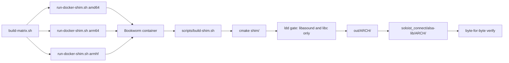
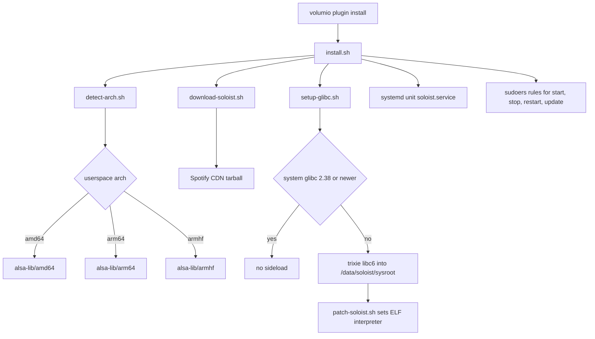
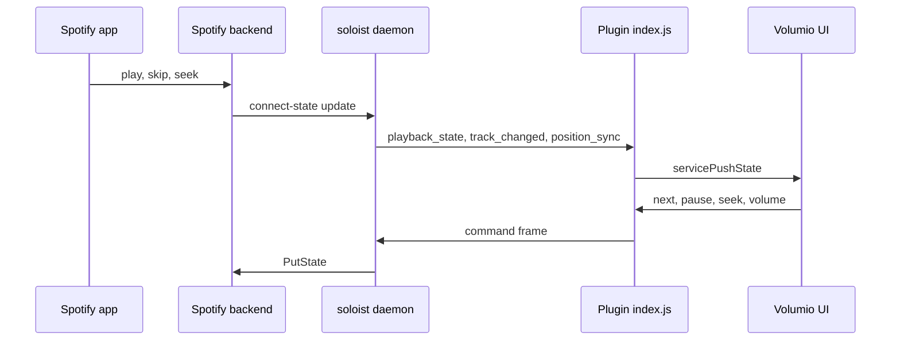

# alsa_soloist_connect

Build system and source for the **Spotify Soloist Connect** plugin for Volumio 4.

The plugin turns a Raspberry Pi or x86 Volumio 4 device into a Spotify Connect endpoint using [Spotify Soloist](https://developer.spotify.com/documentation/soloist), with audio leaving through `pcm.volumio`.
There is no PulseAudio daemon and no PipeWire on the device.

This repository holds the plugin and the in-tree Pulse shim. Cutting-edge work and bugfixes stay here. An accepted build is published to the Volumio plugin store as a separate process.

> **Beta, version 0.8.0.**
> This is the first beta. The store package, when published, is a separately accepted build.

> **Unofficial project.**
> Not affiliated with, endorsed by or sponsored by Spotify AB.
> See [Trademarks](#trademarks) and [THIRD-PARTY-NOTICES.md](THIRD-PARTY-NOTICES.md).

User-facing documentation lives in [`soloist_connect/README.md`](soloist_connect/README.md), which ships inside the plugin package.
This document is for people building or modifying the plugin.

---

## Why a shim is needed

Soloist has no ALSA backend. It plays through PipeWire, or falls back to PulseAudio. Volumio 4 has neither.

The plugin therefore ships a purpose-driven `libpulse.so.0` from [`shim/`](shim/) and launches Soloist with `LD_LIBRARY_PATH` pointed at it.
The library implements the 47 `pa_*` symbols Soloist `dlsym`s ([`shim/ABI.txt`](shim/ABI.txt)) and writes FLOAT32 into `plug:volumio`, so Volumio's volume control, DSP and other AAMPP contributions all apply. The outer `plug:` converts; the shim does not pick S16/S32.

It is not [apulse](https://github.com/i-rinat/apulse) and not a Pulse server. Library version is **0.2.9**. There is no tag pin: the source is this repository, and `SOURCE_REVISION` is the git HEAD that produced each shipped `.so`.


Nothing else on the system is touched.
PulseAudio is never installed, and the system glibc is never modified.

---

## Repository layout

| Path | What |
|---|---|
| `shim/` | Pulse shim 0.2.9 source. See [`shim/README.md`](shim/README.md). |
| `soloist_connect/` | The Volumio plugin. This is what gets zipped and installed. |
| `soloist_connect/README.md` | User-facing documentation, ships with the package. |
| `soloist_connect/LICENSE` | MIT, ships with the package. |
| `soloist_connect/index.js` | Plugin controller: daemon lifecycle, WebSocket client, state mapping, queue mode, browse tile. |
| `soloist_connect/assets/` | Browse-tile sourceicon (`spotify.svg`). |
| `soloist_connect/test/` | Queue-mode and browse harness. No daemon, no ALSA. `npm test` from `soloist_connect/`. |
| `soloist_connect/alsa-lib/{amd64,arm64,armhf}/` | Shipped `libpulse.so.0`, built by the Docker matrix. |
| `soloist_connect/*.sh` | Arch detection, CDN download, glibc sideload, ELF patch, launcher, install, uninstall. |
| `docker/Dockerfile.shim.{amd64,arm64,armhf}` | Bookworm build images. `libasound2-dev` and a toolchain, nothing else. |
| `docker/run-docker-shim.sh` | Live builder. Compiles `shim/` in a Bookworm container. |
| `scripts/build-shim.sh` | Runs inside the container. |
| `build-matrix.sh` | Builds all three architectures. |
| `THIRD-PARTY-NOTICES.md` | Full attribution for everything this project aggregates. |

`out/` is build output and is not committed.
The Soloist binary is never committed and never packaged.

---

## Building the Pulse shim

The plugin package must contain `alsa-lib/<arch>/libpulse.so.0` for the target architecture.
Those libraries are built from `shim/` in Docker on a host with `qemu-user-static` for the ARM targets.



All three architectures:

```
cd alsa_soloist_connect
./build-matrix.sh
```

One architecture:

```
./docker/run-docker-shim.sh amd64 --verbose
```

The build installs its output into `soloist_connect/alsa-lib/<arch>/` and compares every file byte-for-byte afterwards.
A mismatch or a missing file fails the build.
There is no manual copy step, deliberately: when there was one, a stale shim shipped while the build log looked correct.

The git HEAD that produced each shipped payload is recorded in `soloist_connect/alsa-lib/<arch>/SOURCE_REVISION`.
Rebuild the matrix after committing shim sources so that file names the commit.

### The ldd gate

The build fails if `libpulse.so.0` links `libpulse`, glib or pcre.
Allowed runtime dependencies are the loader, the libc family and `libasound.so.2`.
The authority for that list is `volumio-os/recipes/base/VolumioBase.conf`, which has `libasound2`.

The build images carry `libasound2-dev` and a toolchain, and nothing else. glib and pcre2 were apulse's dependencies and are deliberately absent, so a reintroduced dependency fails at compile time rather than being caught by the gate afterwards.

---

## What this shim does

The contract is in [`shim/src/stream.c`](shim/src/stream.c). A longer note is in [`shim/README.md`](shim/README.md).

**S16 into `plug:volumio`.** Soloist decodes to FLOAT32. The shim converts to S16_LE (S32_LE if S16 is refused) and writes that. Packed S24_3LE is never opened: `plug` accepts it and `volumioswitch` then fails. `pcm.softvolume` is not assumed to exist. Played time is taken from the PCM we opened (`write_index` − ring − `snd_pcm_delay`), not by scanning `/proc/asound` for another card. Bit-perfect is not possible on this chain.

**Pulse parameters pace the client, not the device.** `tlength` (capped by `APULSE_MAX_TLENGTH_MS`) and `minreq` are the Pulse buffer target and write quantum. The ALSA period is `snd_pcm_hw_params_set_period_size_near`. Deriving the period from `minreq` as frames produced ~882 and coupled the Output Buffer slider to the IRQ size; testers changing the slider could not uncouple them.

**The ring is sized in time** at the client's own frame size, not a fixed byte count. A 72 KB ring is 418 ms of S16 stereo and 209 ms of FLOAT32 stereo. Soloist decodes lossy to S16 and lossless to FLOAT32, so a byte-sized ring gave lossless half the buffer while writing twice as much per call.

**`pa_stream_writable_size` is the room left against `tlength`**, not the whole ring. A real Pulse server holds the client at the level it was told to hold. Without that bound the client writes until the ring is full, stalls, then bursts. That alternation was the lossless hunt: Soloist supplied at about 1.234x realtime, filled the ring, got zero, then burst again.

A flush discards the ring, so both `write_index` and `read_index` reset with it. Leaving `write_index` at its accumulated value made `fill` read as the whole session and `writable_size` return zero permanently. `pa_stream_disconnect` has the same hazard on reconnect.

**Flush discards the ring, not the PCM.** `pa_stream_flush` drops queued Pulse bytes and resets `write_index` / `read_index`. It does not `snd_pcm_drop` or `prepare`. Drop on a handle whose `avail` still looked healthy is what killed Motivo MultiRoom `volumioOutput` on the second seek. Committed ALSA audio plays out to the output-buffer bound. If the handle is already dead (`drop_unsafe`, or a hard `avail` error), flush still reopens on the existing close worker.

**Cork is not a close.** Pause keeps the PCM so resume is instant. Closing on cork creates a new device instance, `hw_ptr` restarts at zero, and the reopen races whoever took the chain. A write gap is not a release either. The close happens only when the plugin writes `APULSE_YIELD_PATH`, or on disconnect.

**READY is synchronous.** `pa_context_connect` sets CONNECTING then READY in the same call. Deferring READY onto the Pulse thread left Soloist in `wait()` forever: no stream, no PCM, Spotify "can't play this right now."

**Stop is bounded.** `snd_pcm_drop` / `close` run on a detached worker. `pa_threaded_mainloop_stop` timed-joins (2 s) and abandons the loop thread rather than joining a closer that never returns. The I/O callback never closes the PCM.

**An xrun is `snd_pcm_prepare` with the playhead held.** Closing from the I/O callback SIGSEGV'd Soloist. Resetting the clock to zero was worse than the original stop: `read_index` then advanced only at underruns. The audio ALSA held is gone, so `read_index` becomes `write_index` less what is still in the ring and was never offered. If `prepare` succeeds and `avail` is still dead, that is not an xrun: it is a dead switcher target, and the reopen path above runs. The I/O callback never closes the PCM; reopen is deferred onto the Pulse loop.

Environment names stay `APULSE_*`. They are historical; renaming is a later change. See [`shim/README.md`](shim/README.md).

---

## Packaging and install

`volumio plugin install` must be run from the plugin tree (`soloist_connect/`), where `package.json` lives.

### Store (accepted beta)

In Volumio: **Plugins → Music Services** → **Spotify Soloist Connect**.

That package can lag this repository.

### Cutting edge - git

```
cd /home/volumio
git clone --depth 1 --filter=blob:none --sparse https://github.com/foonerd/alsa_soloist_connect.git
cd alsa_soloist_connect
git sparse-checkout set soloist_connect
cd soloist_connect
volumio plugin install
```

### Cutting edge - GitHub zip

```
cd /home/volumio
wget -O alsa_soloist_connect-main.zip https://github.com/foonerd/alsa_soloist_connect/archive/refs/heads/main.zip
miniunzip alsa_soloist_connect-main.zip
cd alsa_soloist_connect-main/soloist_connect
volumio plugin install
```

If the zip is already in `/home/volumio`, skip `wget` and run `miniunzip` on that file. The archive unpacks to `alsa_soloist_connect-main/soloist_connect/`.

### Replacing a previous git or zip install

1. Uninstall the plugin from the Volumio UI.
2. Remove the old checkout, if it is still on the device:

```
cd /home/volumio
sudo rm -rf alsa_soloist_connect alsa_soloist_connect-main
```

3. Reboot, then install again with git or zip as above.

### What the installer does



Notable points:

- `libatomic1` and `patchelf` are installed if missing.
- Bookworm's glibc is 2.36 and Soloist needs 2.38 or newer. A private sysroot is sideloaded into `/data/soloist/sysroot` and the binary is ELF-patched against it. The system glibc is left alone. Launching through an explicit `ld-linux` instead of patching breaks Soloist's subprocesses.
- The launcher exports the ALSA device as `APULSE_PLAYBACK_DEVICE`, derived from `PLAYBACK_DEVICE` in the env file. The names are historical. The unit deliberately does **not** pin the device: the launcher treats an existing value as an override, so a pinned unit would win permanently and PeppyMeter metering would silently do nothing. `unpin-playback-device.sh` removes the line from older installs. The launcher also exports `APULSE_MAX_TLENGTH_MS`, `APULSE_YIELD_PATH`, `APULSE_EXTERNAL_VOLUME` and, when non-zero, `APULSE_OUTPUT_TRIM_DB`.
- Exit code 10 means the build expired. The unit uses `RestartPreventExitStatus=10` so it does not loop; the plugin re-downloads on the next start.
- Sudoers rules are named `volumio-user-soloist_connect` so they are included after `/etc/sudoers.d/volumio-user`, matching the convention in `volumio-plugins-sources-bookworm`.

---

## Architecture detection

`detect-arch.sh` picks both the Soloist binary and the shim libraries from the userspace ABI (`dpkg`, `getconf LONG_BIT`, then `VOLUMIO_ARCH`), not from the kernel's `uname -m`.
The official Volumio 4 Pi image is armhf even when the kernel is 64-bit, and 64-bit Pi 5 images sometimes still report `VOLUMIO_ARCH=arm`.

| Userspace | Soloist CDN archive | Shim payload | Store architecture |
|---|---|---|---|
| `amd64` | `soloist_release_x86_64.tar.gz` | `alsa-lib/amd64` | `amd64` |
| `armhf` | `soloist_release_arm32.tar.gz` | `alsa-lib/armhf` | `armhf` |
| `arm64` | `soloist_release_arm64.tar.gz` | `alsa-lib/arm64` | none, manual install only |

armv6 (Pi 1, Pi Zero v1) is not supported by Soloist.

### Store architectures are not build architectures

The Volumio plugin store accepts only `amd64` and `armhf` in `volumio_info.architectures`.
Those are the two values `package.json` declares.

Do not confuse them with the volumio-os build targets (`arm`, `armv7`, `armv8`, `x64`), which are a different namespace and will be rejected by the store.

The arm64 shim payload is kept in the tree because `detect-arch.sh` can select it at runtime on a 64-bit userspace image, but it has no store architecture to be published under.
Official Volumio 4 Pi images are armhf userspace even on a 64-bit kernel, so the armhf package covers them.

Plugins must be submitted with `volumio plugin submit` from a running Bookworm device, once per architecture, and the version number must change for every resubmission.

---

## Control and state flow

The plugin is a WebSocket client of the Soloist daemon on `127.0.0.1:9878`.
Commands go one way, events come back the other.



Behaviour worth knowing when reading `index.js`:

- **The PCM is the lock.** Device ownership is not tracked with plugin flags; it is read from `/proc/asound/card*/pcm*p/sub*/status`. See [Device ownership](#device-ownership).
- `is_active` is only trusted when the event actually carries it. Several Soloist events omit it, and treating a missing field as false used to end the session and cause a play/pause loop.
- Volumio's state machine calls `stop()` on volatile services shortly after volatile mode begins. That echo is swallowed for two seconds; every later stop is a real request and is honoured.
- **The seek timer ticks, but does not publish.** It advances `seek` once a second on the object handed to `servicePushState`, which `CoreStateMachine.syncState` keeps by reference as `volatileState` and `getState()` reads `seek` from. That is how the bar moves: the UI does not interpolate, and skip, seek and a browser refresh all take their origin from that value. Stock `spop` achieves the same by ticking `this.state` because it pushes that object directly; this plugin publishes a snapshot, to stop core aliasing our mutable state during a nested publication, so the tick writes to the snapshot instead. A publish per second must never come back: it runs the state machine, `volumiodiscovery`, every interface plugin and MRS's multiroom sync, and MRS plus `volumioswitch` then fails `snd_pcm_avail(softvolume)` and XRUNs the DAC.
- **The position anchor rejects an implausible timestamp.** `currentSeekMs()` is `position_ms + (now - timestamp_ms)`, so a skewed clock, or a `timestamp_ms` sent in seconds rather than milliseconds, moves the bar by the size of the error. Anything more than two seconds from now is discarded and the position is anchored to the present.
- `buffering` is mapped to the current status rather than to `pause`, so the state machine does not flap at every track start. In Connect mode `idle` is mapped the same way while playing: it is the gap between Spotify tracks, not a source stop, and publishing it as `stop` hit Volumio's end-of-block path, which starts the next queue item, while our own `stop()` paused Soloist. Nothing advanced. In queue mode that path is what we want, so `idle` after the row has started is stop.
- Volume is mirrored both ways with a short collapse window, so a slider drag does not queue one `set_volume` per tick ahead of a skip.
- **Queue mode is not volatile.** See [Queue mode](#queue-mode).
- Sample rate comes from ALSA `hw_params` on the open playback stream, since the Soloist WebSocket API does not report it. With FusionDSP enabled this reports CamillaDSP's output rate rather than the stream's; FusionDSP publishes the true stream parameters to `/tmp/fusiondsp_stream_params.log`, which this does not yet read.
- The bit depth field carries the Spotify quality tier instead of a bit depth. See [Reporting the quality tier](#reporting-the-quality-tier).

---

## Queue mode

Off by default (`queue_playback`). Connect mode is unchanged: volatile, Spotify owns the playhead, `next`/`prev` are `skip_next`/`skip_prev`.

When on, a Volumio queue row whose `service` is `soloist_connect` and whose URI is `spotify:track:…` is played with `play { uri }`. That needs `logged_in`. The phone does not have to be open. `is_active` is recorded immediately as `deviceActive` so a seek blink on the lagged `active` flag cannot skip a row we can play.

Two modes, never both:

| | Connect | Queue |
|---|---|---|
| Playhead | Spotify | Volumio's mixed list |
| Volatile | yes | no |
| `next` / `prev` | plugin → Soloist | core, next service |
| `idle` | stay play | stop after the row has started |
| End of URI | Soloist autoplay | pause, yield, publish stop |

A row that cannot play (setting off, not logged in, not a track URI, or another device holds the session and remote play is off) calls `stateMachine.next()` on the next turn. Publishing stop while core is still inside `play()` with `currentStatus === 'stop'` hits syncState's empty branch and the list does not move.

The row ends on buffering within 1.5 s of duration, idle after first audio, `track_changed` to another URI, or a roll. `endQueueRow` waits for ALSA if we still hold it. `startPlaybackTimer` is not called when metadata arrives: that would arm a second seek clock. Duration is written onto `currentSongDuration` instead.

`owningPlayback()` is `volatileSet || queueMode`, so seek, mixer and quality retry still work on a queue row. `queue_changed` is harvested for `explodeUri` metadata and for a browse tile that is registered only while `queue_playback` is on. An open tile is refreshed from those events (full `get_queue`, because a broadcast `queue_changed` is capped at 10). Soloist's upcoming list is not pushed into Volumio's play queue.

Settings that only this process reads do not restart the daemon. A section save posts only its fields; absent keys keep the stored value.

The harness is `soloist_connect/test/queue-mode.test.js`.

---

## Device ownership

A Volumio source holds the audio device only while it is playing, and publishes state only while it owns the session. This plugin took a long time to get there, because ownership was tracked with plugin-local booleans while the thing actually contended for was the ALSA device.

The model is now the same as bluetooth's `btAudioOutput`: **the PCM is the lock, and a yield does not return until we no longer hold it.** Bluetooth can SIGKILL `bluealsa-aplay`; Soloist cannot be killed, so the close is requested explicitly and the plugin waits for the owner to disappear from `/proc/asound`.

**Cork is not a close.** Pausing in the Spotify app keeps the device, which is what makes resume instant and gapless. Closing on cork was tried and reverted: a close creates a new device instance, and the reopen fought whoever had taken the chain in the meantime.

The close is therefore signalled, not inferred. The plugin writes `/data/soloist/alsa.yield`; the shim closes the PCM when it sees that file and unlinks it. `APULSE_YIELD_PATH` is exported by `launch-soloist.sh`. The file is cleared on daemon start and at the top of every takeover, so a stale one cannot release a session that is starting.

Four helpers read the lock:

| Function | What it answers |
|---|---|
| `alsaOwnerPids()` | every `owner_pid` across the playback substreams |
| `daemonPids()` | which of those are ours: the unit's `MainPID`, plus any owner whose `comm` is `soloist` or `launch-soloist.sh` |
| `alsaHeldByUs()` / `alsaHeldByOther()` | the two comparisons |
| `waitUntil(pred, ms)` | polls at 20 ms with a ceiling, resolving either way |

**Yield** happens in `unsetVolatile()`, `stop()`, and `endQueueRow()`. Request the close, pause, then wait until the PCM is no longer ours. Volumio then starts the next service against a free device. Without the wait, MPD reported `Failed to open ALSA device "volumio": Device or resource busy` in the same second the pause was sent, because `clearQueue` does not await the stop promise. `endQueueRow` publishes stop only after the card is free, or immediately if we already released it.

**Takeover**, in `takeOverPlayback()`, is serialised by `takeoverInFlight`:

1. if core already names us, or we already hold the session, clear the yield file and claim. A play from the phone while we hold the session is not a takeover, and `unSetVolatile` would run the volatile callback, which is ours, pausing Soloist on every play.
2. otherwise, synchronously: set `mpd.ignoreUpdate(true)`, clear the consume-update service, and drop our own volatile registration so `volumioStop` stops the other service rather than pausing us
3. `volumioStop()`, ask any remaining ALSA holder (from `comm`) to release, then wait until no other process holds the device
4. claim, and clear the yield file

**Takeover must not yield.** On first play the device is already open, and Peppyalsa negotiates a different period than we do. Releasing our own handle and reopening in that state failed `avail()`. Takeover displaces whoever else holds the device; it does not release ours.

`ignoreUpdate` is why step 2 exists at all. MPD announces its stop, `syncState` reads that as end-of-track and starts the next queue item, and MPD is back on `pcm.volumio` alongside Soloist. ytcr and squeezelite_mc mute it the same way. It is cleared on start, on stop, on yield and in `unsetVolatile`, so it can never be left latched.

The UI claim is unconditional, including when the wait expires. Refusing to claim was tried: the user pressed play and got a session that belonged to nobody. The shim does not treat `EBUSY` as a failed first open: corked connect does not open, and a busy card is a wait. The first `pcm open` line is success, or one hard fail that names the holder.

Two state rules that are not obvious and both came from real failures:

`active` is Spotify Connect device status and is **not** cleared on yield. Clearing it made the next `is_active=true` look like a fresh selection, and the session was stolen back from MPD.

`pendingYieldAt` covers the opposite race. A `play` arriving within 1.5 s of a yield is leftover from the session we just released, not a request, and is treated as a pause.

Takeover fires on the transition into play, not on activation. After the user switches away, Soloist stays the active Connect device, so `is_active` never transitions again; without the play trigger, pressing play in the app produced audio with no Volumio state at all.

The corresponding half is in the shim: the PCM survives cork and uncork. Flush keeps the same handle while it is healthy. After a dead switcher target, flush reopens. The close that yields the device still happens only when the yield file appears.

---

## Volume

Where the attenuation happens depends on Volumio's mixer, read from `alsa_controller`'s `mixer_type`.

With a mixer, SoftMaster or hardware, that mixer is the attenuator and the source must stay at full scale. The Spotify app's slider is mirrored into Volumio's fader with `volumiosetvolume`, so the signal entering the chain is pre-fader. This is what PeppyMeter needs: a meter reads the signal where it is inserted, above the fader, so a scaled source makes the needle follow the volume knob rather than the music.

With `mixer_type` `None` there is no ALSA gain anywhere, so the shim keeps scaling and the mixer is left alone.

Two rules that are not obvious:

**Mixer writes are gated on ownership.** A value arriving before we are `active` and volatile is parked in `pendingMixerVolume` and flushed at the end of `setVolatile()`. The first `playback_state` runs `takeOverPlayback`, whose `volumioStop` is asynchronous, so writing the mixer in the same tick meant an `amixer` against a softvolume MPD still owned.

**The echo guard is a timer, not a tick.** `volumeFromSoloist` is a 1.5 s window cleared by the returning event. A `setImmediate` expired long before the mixer round trip came back, so our own change was read as the user's and mirrored to Connect again.

Both directions use a two-step deadband, and the outbound mirror collapses bursts so a slider drag does not queue one `set_volume` per tick ahead of a skip: Soloist handles commands serially and that queue was seconds of lag.

### Output trim

A fixed offset on the stream, `-12` to `+12` dB, default 0. Distinct from volume: it changes the level entering the chain, not the knob.

It exists because with `APULSE_EXTERNAL_VOLUME` set the shim does no sample scaling at all, so this is the only place a per-source offset can be applied. It is what raises or lowers what per-source meters and the mixer see from Spotify without affecting MPD or anything else.

`output_trim_db` reaches the daemon as `OUTPUT_TRIM_DB`, and `launch-soloist.sh` exports `APULSE_OUTPUT_TRIM_DB` only when it is non-zero. The shim applies it before the ALSA write.

The launcher validates with an explicit case list rather than a `[0-9]*` glob. A leading minus does not match that glob, so `-6` would have been silently discarded and the setting would have appeared to work in one direction only.

---

## PeppyMeter integration

PeppyMeter meters per source rather than across the whole chain. Its contribution renders `pcm.spotify` either as a passthrough or as a `multi` that sends the audio to `postpeppyalsa` and a duplicate to a meter, and it decides which from its own setting.

It cannot rewrite this plugin's configuration the way it rewrites `spop`'s YAML, so it calls `setPeppyMetering(bool)` instead. That stores `peppy_metering`, rewrites the env file, and restarts the daemon when the running process is on the wrong device.

`playbackDevice()` resolves the result: `plug:spotify` when metering is on **and** `pcm.spotify` is actually present in `/etc/asound.conf`, otherwise `plug:volumio`. The setting alone is not enough, because that PCM only exists once PeppyMeter has rendered its contribution; without the check a restart would try to open a device that is not there.

The other direction is covered on start. `syncPeppyMeteringFromPeppy()` asks PeppyMeter's `soloistMeteringWanted()` and adopts the answer, so the two plugins agree whichever is enabled second.

### The systemd pin had to go

`PLAYBACK_DEVICE` is written to the env file and read by `launch-soloist.sh`, which treats an existing `APULSE_PLAYBACK_DEVICE` as a deliberate override. Older installs pinned that in the unit:

```
Environment=APULSE_PLAYBACK_DEVICE=plug:volumio
```

which wins permanently, so the env file would never be read and metering would appear to do nothing at all. `unpin-playback-device.sh` strips that line and reloads systemd; `onStart` runs it whenever the line is present. `install.sh` no longer writes it, and both sudoers entries are in place.

`peppy_metering` is deliberately absent from `UIConfig.json`. PeppyMeter owns the toggle, and two switches for one behaviour drift apart.

### Running alongside the stock Spotify plugin

`warnIfSpopStarted()` reads `/data/configuration/plugins.json` and toasts a warning when `music_service.spop` is STARTED, on plugin start and when the settings page opens. Both plugins claim the same source and the same metered PCM; running them together is not supported.

---

## Reporting the quality tier

The now-playing line shows the Spotify quality tier, matching the names in the app's audio quality menu: Low, Normal, High, Very High, Lossless.

Nothing in Soloist reports it. The WebSocket schema is fully documented and `playback_state` carries only `status`, `item`, `context`, `position`, `volume`, `is_active`, `options` and `available_actions`; the entity envelope carries `identity`, `visual_identity`, `parent`, `creators` and `playback.duration_ms`. There is no codec, bitrate, sample rate or quality field anywhere, and others have asked Spotify for one on the developer forum. Its FFmpeg stream-info dump is debug-only: verified with `--verbose` confirmed on the running daemon and 60 s of playback captured, producing no output.

Bit depth is no guide either. Soloist decodes every quality into `FLOAT_LE`, and `/proc/asound` shows the endpoint after `pcm.softvolume` converts, so that field read `24 bit` for lossy and lossless alike. It carries the tier instead, which is what the user actually chose, and it lands where Volumio already shows quality beside the sample rate. The stock Spotify plugin does the same thing with its configured bitrate string.

The measurement is the cache. Soloist writes one content-addressed file per track and it is already complete when playback starts: sampled every two seconds over ten, the size did not move. Size against `duration_ms` is therefore the exact average bitrate.

**The file is identified by open descriptor, not by mtime.** Soloist holds the playing track's file open under `/proc/<pid>/fd`, and it follows every skip within a second. Audio payloads are under `cache/cache/`; the LevelDB metadata store is under `data/cache/` and must not match.

Choosing by mtime instead was wrong, and wrong quietly. The two newest files are usually the current track and its prefetch, but under skipping there are several partial downloads in flight, and the duration comes from the current `track_changed` event while the file came from the cache. The same 6289411 bytes was reported against 185 s and then 232 s, giving Very High and then High for one file.

A new open file is measured immediately. The last file against a new URI is refused: that is the 6289411 pairing, one file measured against two durations. On a skip with two files open, the last path is excluded and the other is measured. A skip clears the published label so the previous track cannot stay on screen. Empty, stale, or ambiguous fds retry using the Quality retry wait and Quality retries settings, then stop. The playing file is never opened; a live header read ended the Connect session.

Measured on device: 333 kbps against Spotify's stated 320 for Very High, and 1654 and 1662 kbps across two different lossless tracks, which is where FLAC at 44.1 kHz sits.

One limitation: this measures what was downloaded, not what Spotify holds. A track only available at a lower tier than selected will show the lower tier. That is arguably more accurate than echoing the setting, but it will differ from the app's menu on some tracks.

---

## Buffering and the ALSA chain

`pcm.volumio` is not a direct path to the hardware. It resolves through `volumioswitch`, an ioplug that keeps its own buffer **and** separately sizes the buffer of its target PCM from `io->buffer_size`, reporting the sum as its delay:

```c
*delayp = local_delay + target_delay;
```

Both stages derive from `buffer_attr.tlength`, so a client's request lands twice, in series. Each stage is capped by the ioplug at `SND_PCM_IOPLUG_HW_BUFFER_BYTES`, 524288 bytes, which is 65536 frames or 1.486 s at 44100 S24_LE stereo. An uncapped 2 s Pulse default therefore produced about 2.97 s of committed audio.

Measured on a Pi with a HiFiBerry DAC, skip command to first audible frame:

| Output device | Latency |
|---|---|
| `plug:volumio` | 3 s |
| `volumio` (empty passthrough) | 3 s |
| `volumioMultiRoomServer` (volumioswitch) | 3 s |
| `volumioLocalPlayback` | 1 s |
| `softvolume` | 1 to 2 s |
| `plughw:sndrpihifiberry` | 1 s |

The hardware buffer read 65536 frames in every case, so the extra time is the switch's own buffer, not the endpoint.

Moving the output device down the chain would recover the time and is the wrong fix: every faster path bypasses the contributions from FusionDSP, PeppyMeter, Stylish Player and mpd_oled, which is the whole reason for entering at `pcm.volumio`. The cap is applied in the shim instead, where it shrinks both stages together because the switch sizes its target from what the client asks for.

At 500 ms the Pulse target is 22050 frames. The ALSA period is not derived from that.

The switch's own `snd_pcm_delay` can still sit at 65536 frames (~1.48 s) after that shrink. Soloist reads that through Pulse as latency; the shim reports `sink_usec = 0` rather than that `/proc/asound` `delay` line.

Pulse `minreq` stays the client's write quantum, typically 20 ms. It is not the ALSA period. The useful floor on the Output Buffer setting is about the software target, not the device IRQ size.

### Recovering from an underrun

An underrun on the chain used to stop playback permanently a few seconds into a track. The stream was not broken; it was waiting on a position that had stopped moving.

`volumioswitch` reports it first, and that line is the only part of the sequence that reaches the journal without diagnostics enabled:

```
pcm_volumioswitch.c:912 PCM volumioMultiRoomServer cannot write to target PCM
softvolume as it has failed its update check
```

That is `snd_pcm_avail` on its target returning a negative errno, which the plugin turns into `-EPIPE` upward. Neither of its two `snd_pcm_prepare(target)` calls is on the advance path, so recovery is the client's job.

The shim prepares the PCM and holds the playhead. The audio ALSA held at the underrun is gone, so `read_index` becomes `write_index` less what is still queued in the ring and was never offered. Resetting the clock to zero was tried and was worse: the stream then progressed only by underrunning.

What triggers the first underrun is still open. Recovery from one is correct; the fill level collapsing to zero in the first place is not accounted for.

### Reading a playback fault

Every diagnostic in the shim is behind `APULSE_DIAG`. The plugin's **Verbose logging** switch sets it, via `VERBOSE_LOGGING` in the env file and `launch-soloist.sh`. The startup line reports `diag=1` or `diag=off` so a capture states its own provenance.

What it makes visible, none of which reaches the journal otherwise:

| Line | What it answers |
|---|---|
| `context ready` | Pulse context reached READY (must appear before any stream) |
| `connect corked= tlength= minreq=` | stream connect parameters actually used |
| `pcm open ... client_fmt= alsa=` | device negotiated (S16, not FLOAT32) |
| `pcm close handed off keep=` | yield or disconnect started a close worker |
| `avail` / `writei` / `pcm prepare failed` | ALSA fault and whether prepare ran |
| `mainloop join timed out, abandoning thread` | stop did not wait forever on `snd_pcm_close` |
| `pa_threaded_mainloop_wait (further calls not logged)` | Soloist is in the wait loop; further wait/lock/write entry lines are suppressed after eight |

The journal is in memory and a reboot destroys it. `journalctl -b -u soloist -u volumio --no-pager > /data/...` before restarting.

---

## Known limitations

- **90-day build expiry.** Soloist builds stop working 90 days after their build date. This is a Spotify design decision. The plugin re-downloads on start and offers a manual update button. The button shows a progress modal, then a 15 second reboot countdown with Restart and Cancel. A failed download leaves the running binary alone.
- **Skip and seek are not instant.** Bounded by the Output Buffer setting. The flush now discards, so what remains is the buffer itself rather than stale audio playing out.
- **Soloist has no latency control of its own.** Its CLI has no buffer or latency option, and the PulseAudio buffer parameters it uses are configured remotely by Spotify. The cap is applied in the shim instead.
- **FusionDSP changes the numbers.** CamillaDSP adds `chunksize`, `target_level` and `extra_samples` beyond our buffer, and its FIFO is `clear_on_drop "false"`. The 500 ms default has not been re-measured with FusionDSP enabled.
- **PeppyMeter metering.** When the screensaver's Spotify metering is on, the daemon plays through `plug:spotify`, PeppyMeter's metered entry at contribution priority 5, so its VU meters respond to Spotify. Contributions above that point are skipped: FusionDSP at 10 and Stylish Player at 7. PeppyMeter already forces its Spotify toggle off when DSP is on. See [PeppyMeter integration](#peppymeter-integration).
- **Switching source pauses Spotify rather than ending the session.** The device stays in the Spotify app's list, which is deliberate: giving up active-device status would make the user re-select the player just to switch back.
- **Queue mode does not rewrite `spop` playlists.** A row must already be `soloist_connect`. The **Spotify Queue** tile (`get_queue` / `queue_changed`) is registered only while `queue_playback` is on. That is Spotify's list, not Volumio's mixed playlist. There is no library browse or search; `explodeUri` only accepts `spotify:track:` and fills names from URIs Soloist has already reported.
- **arm64 is unverified at runtime.** Built by the matrix, but only armhf and amd64 have been exercised.
- **The RAM cache is untested at its limit.** Selecting RAM mounts a tmpfs over `/data/soloist/cache`, sized at a quarter of `MemTotal` and capped by the Cache size setting. Whether the daemon evicts or aborts when that filesystem fills has not been observed, because no session has yet reached the ceiling.
- **The first underrun is unexplained.** Recovery from one is now correct, but the fill level collapsing to zero in the first place is not accounted for. See [Recovering from an underrun](#recovering-from-an-underrun).
- armv6 devices are out of scope.

---

## Where to report problems

This repository does not own the upstream components it integrates.
Please route reports to the project that can act on them.

| Symptom | Where it belongs |
|---|---|
| Plugin behaviour, packaging, install, Volumio integration | this repository |
| Pulse shim (`libpulse.so.0`) playback, xruns, stop hangs | this repository |
| Soloist client bugs and crashes | [spotify/soloist issues](https://github.com/spotify/soloist/issues) (issue creation is currently restricted) |
| Soloist questions, support, feature requests | the [Spotify Developer Community](https://developer.spotify.com/community) thread linked from the Soloist docs |
| Spotify account, playback rights, Connect behaviour | Spotify support |
| Volumio core, AAMPP, ALSA chain | Volumio's own trackers |

**Never post API keys, unredacted logs, crash reports or data directory contents in any public tracker.**
Spotify's documentation states this explicitly for Soloist, and it applies here too.

---

## Licence

MIT, Copyright (c) 2026 Just a nerd. See [LICENSE](LICENSE).

This repository aggregates third-party components and does not relicense, override or replace any of their terms.
Every redistributed component keeps its own licence, and those terms govern that component.

Summary:

| Component | Licence | Redistributed here |
|---|---|---|
| This project's code, including the Pulse shim | MIT | yes, source in `shim/` and as `libpulse.so.0` under `soloist_connect/alsa-lib/` |
| PulseAudio public headers | LGPL-2.1-or-later | yes, build-time only, in `shim/include/pulse/` |
| Spotify Soloist | proprietary, Spotify AB | **no**, downloaded from Spotify's CDN at install time |
| glibc sideload packages | LGPL-2.1-or-later and Debian terms | no, downloaded from the Debian archive at install time |

Full detail and the Soloist redistribution position are in [THIRD-PARTY-NOTICES.md](THIRD-PARTY-NOTICES.md).

---

## Trademarks

None of these marks are owned by this project.
They are used descriptively, to identify the software this plugin works with.
No affiliation, endorsement or sponsorship is claimed or implied.

| Mark | Owner |
|---|---|
| Spotify, Spotify Connect, Spotify Soloist | Spotify AB |
| Volumio | Volumio SRL |
| Raspberry Pi | Raspberry Pi Ltd |
| Debian | Software in the Public Interest, Inc. |
| Linux | Linus Torvalds |

---

## Credits

- [wheaten](https://github.com/wheaten/) started this work.
- [nerd](https://github.com/foonerd/) took it over and carried it to the Volumio 4 ALSA path.
