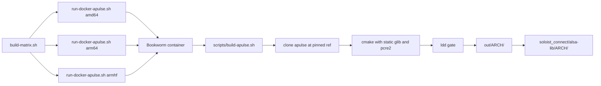
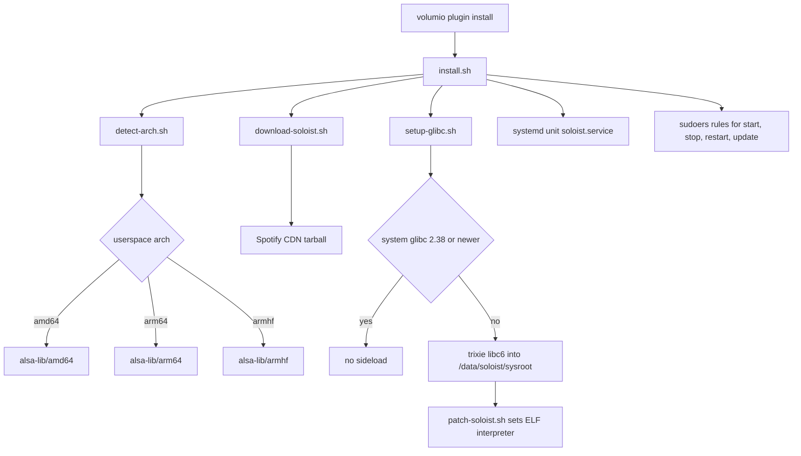
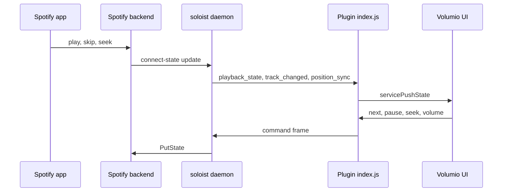

# alsa_soloist_connect

Build system and source for the **Spotify Soloist Connect** plugin for Volumio 4.

The plugin turns a Raspberry Pi or x86 Volumio 4 device into a Spotify Connect endpoint using [Spotify Soloist](https://developer.spotify.com/documentation/soloist), with audio leaving through `pcm.volumio`.
There is no PulseAudio daemon and no PipeWire on the device.

This repository holds two things: the plugin that ships to the Volumio plugin store, and the Docker build matrix that produces the native shim the plugin carries.

> **Alpha, version 0.2.0.**
> Under active development, not ready for user testing.
> Versioning and packaging will be revised before any release.

> **Unofficial project.**
> Not affiliated with, endorsed by or sponsored by Spotify AB.
> See [Trademarks](#trademarks) and [THIRD-PARTY-NOTICES.md](THIRD-PARTY-NOTICES.md).

User-facing documentation lives in [`soloist_connect/README.md`](soloist_connect/README.md), which ships inside the plugin package.
This document is for people building or modifying the plugin.

---

## Why a shim is needed

Soloist has no ALSA backend. It plays through PipeWire, or falls back to PulseAudio. Volumio 4 has neither.

The plugin therefore ships a private copy of [apulse](https://github.com/i-rinat/apulse), a PulseAudio client API implementation that talks to ALSA directly, and launches Soloist with `LD_LIBRARY_PATH` pointed at it.
apulse opens `pcm.volumio`, so Volumio's volume control, DSP and other AAMPP contributions all apply.


Nothing else on the system is touched.
PulseAudio is never installed, and the system glibc is never modified.

---

## Repository layout

| Path | What |
|---|---|
| `soloist_connect/` | The Volumio plugin. This is what gets zipped and installed. |
| `soloist_connect/README.md` | User-facing documentation, ships with the package. |
| `soloist_connect/LICENSE` | MIT, ships with the package. |
| `soloist_connect/index.js` | Plugin controller: daemon lifecycle, WebSocket client, state mapping. |
| `soloist_connect/lib/` | Local helpers (`q`, `miniws`, `vconf`) so the plugin has no npm dependencies. |
| `soloist_connect/alsa-lib/{amd64,arm64,armhf}/` | apulse payload, built by the Docker matrix. |
| `soloist_connect/alsa-lib/LICENSE.apulse` | apulse licence, travels with the binaries it covers. |
| `soloist_connect/*.sh` | Arch detection, CDN download, glibc sideload, ELF patch, launcher, install, uninstall. |
| `docker/` | One Bookworm Dockerfile per architecture, plus the runner. |
| `scripts/build-apulse.sh` | Runs inside the container. |
| `build-matrix.sh` | Builds all three architectures. |
| `THIRD-PARTY-NOTICES.md` | Full attribution for everything this project aggregates. |

`out/` is build output and is not committed.
The Soloist binary is never committed and never packaged.

---

## Building the apulse shim

The plugin package must contain `alsa-lib/<arch>/libpulse.so.0` for the target architecture.
Those libraries are built in Docker on a host with `qemu-user-static` for the ARM targets.



All three architectures:

```
cd alsa_soloist_connect
./build-matrix.sh
for a in amd64 arm64 armhf; do
  cp -a out/$a/. soloist_connect/alsa-lib/$a/
done
```

One architecture:

```
./docker/run-docker-apulse.sh amd64 --verbose
```

Override the source revision when testing:

```
APULSE_REF=master ./docker/run-docker-apulse.sh amd64
```

### The ldd gate

The build fails if the resulting libraries link anything that is not on a stock Volumio 4 image.
The authority for that list is `volumio-os/recipes/base/VolumioBase.conf`, which has `libasound2` but not `libglib2.0`.
glib and pcre2 are therefore linked statically by rewriting the cmake `link.txt` files to use the `.a` paths.

Allowed runtime dependencies are the loader, the libc family, `libasound.so.2`, and the sibling `libpulse*` libraries.
Anything else rejects the build.

The pinned revision that produced each shipped payload is recorded in `soloist_connect/alsa-lib/<arch>/SOURCE_REVISION`.

Static linking of GLib carries an LGPL relink obligation.
It is satisfied by publishing this build recipe.
See [THIRD-PARTY-NOTICES.md](THIRD-PARTY-NOTICES.md) for the detail.

---

## Packaging and install

```
cd /home/volumio
mkdir -p soloist_connect && miniunzip soloist_connect.zip -d soloist_connect
cd soloist_connect
volumio plugin install
```

### What the installer does



Notable points:

- `libatomic1` and `patchelf` are installed if missing.
- Bookworm's glibc is 2.36 and Soloist needs 2.38 or newer. A private sysroot is sideloaded into `/data/soloist/sysroot` and the binary is ELF-patched against it. The system glibc is left alone. Launching through an explicit `ld-linux` instead of patching breaks Soloist's subprocesses.
- The unit sets `APULSE_PLAYBACK_DEVICE=plug:volumio`.
- Exit code 10 means the build expired. The unit uses `RestartPreventExitStatus=10` so it does not loop; the plugin re-downloads on the next start.
- Sudoers rules are named `volumio-user-soloist_connect` so they are included after `/etc/sudoers.d/volumio-user`, matching the convention in `volumio-plugins-sources-bookworm`.

---

## Architecture detection

`detect-arch.sh` picks both the Soloist binary and the apulse libraries from the userspace ABI (`dpkg`, `getconf LONG_BIT`, then `VOLUMIO_ARCH`), not from the kernel's `uname -m`.
The official Volumio 4 Pi image is armhf even when the kernel is 64-bit, and 64-bit Pi 5 images sometimes still report `VOLUMIO_ARCH=arm`.

| Userspace | Soloist CDN archive | apulse payload | Store architecture |
|---|---|---|---|
| `amd64` | `soloist_release_x86_64.tar.gz` | `alsa-lib/amd64` | `amd64` |
| `armhf` | `soloist_release_arm32.tar.gz` | `alsa-lib/armhf` | `armhf` |
| `arm64` | `soloist_release_arm64.tar.gz` | `alsa-lib/arm64` | none, manual install only |

armv6 (Pi 1, Pi Zero v1) is not supported by Soloist.

### Store architectures are not build architectures

The Volumio plugin store accepts only `amd64` and `armhf` in `volumio_info.architectures`.
Those are the two values `package.json` declares.

Do not confuse them with the volumio-os build targets (`arm`, `armv7`, `armv8`, `x64`), which are a different namespace and will be rejected by the store.

The arm64 apulse payload is kept in the tree because `detect-arch.sh` can select it at runtime on a 64-bit userspace image, but it has no store architecture to be published under.
Official Volumio 4 Pi images are armhf userspace even on a 64-bit kernel, so the armhf package covers them.

Plugins must be submitted with `volumio plugin submit` from a running Bookworm device, once per architecture, and the version number must change for every resubmission.

---

## Control and state flow

The plugin is a WebSocket client of the Soloist daemon on `127.0.0.1:9878`.
Commands go one way, events come back the other.



Behaviour worth knowing when reading `index.js`:

- The plugin takes over playback when Soloist becomes the active Connect device: it stops MPD and clears the consume-update service so `pcm.volumio` is free. Pi I2S is exclusive; x86 HDA and USB often have dmix.
- `is_active` is only trusted when the event actually carries it. Several Soloist events omit it, and treating a missing field as false used to end the session and cause a play/pause loop.
- Volumio's state machine calls `stop()` on volatile services during normal state syncing. While a Connect session is active those calls are ignored.
- `buffering` is mapped to the current status rather than to `pause`, so the state machine does not flap at every track start.
- Volume is mirrored both ways with a short collapse window, so a slider drag does not queue one `set_volume` per tick ahead of a skip.
- Sample rate and bit depth come from ALSA `hw_params` on the open playback stream, since the Soloist WebSocket API does not report them.

---

## Known limitations

- **90-day build expiry.** Soloist builds stop working 90 days after their build date. This is a Spotify design decision. The plugin re-downloads on start and offers a manual update button.
- **Control latency.** Skip, seek and pause can take noticeably longer to take effect than on a native Spotify Connect device. Under investigation. The leading hypothesis is the output buffer: apulse implements `pa_stream_flush` as a no-op and cannot rewind an ALSA ring the way PulseAudio or PipeWire rewind a mix buffer, so audio already committed downstream keeps playing after a skip. Not yet confirmed by measurement on hardware.
- **No supported latency control in Soloist.** Its CLI has no buffer or latency option, and the PulseAudio buffer parameters it uses are configured remotely.
- armv6 devices are out of scope.

---

## Where to report problems

This repository does not own the upstream components it integrates.
Please route reports to the project that can act on them.

| Symptom | Where it belongs |
|---|---|
| Plugin behaviour, packaging, install, Volumio integration | this repository |
| Soloist client bugs and crashes | [spotify/soloist issues](https://github.com/spotify/soloist/issues) (issue creation is currently restricted) |
| Soloist questions, support, feature requests | the [Spotify Developer Community](https://developer.spotify.com/community) thread linked from the Soloist docs |
| Spotify account, playback rights, Connect behaviour | Spotify support |
| apulse behaviour, including the flush and buffering findings | [i-rinat/apulse issues](https://github.com/i-rinat/apulse/issues) |
| Volumio core, AAMPP, ALSA chain | Volumio's own trackers |

**Never post API keys, unredacted logs, crash reports or data directory contents in any public tracker.**
Spotify's documentation states this explicitly for Soloist, and it applies here too.

---

## Licence

MIT, Copyright (c) 2026 Just a nerd. See [LICENSE](LICENSE).

This repository aggregates third-party components and does not relicense, override or replace any of their terms.
Every redistributed component keeps its own licence, and those terms govern that component.

Summary:

| Component | Licence | Redistributed here |
|---|---|---|
| This project's code | MIT | yes |
| apulse | MIT | yes, as prebuilt libraries under `soloist_connect/alsa-lib/` |
| GLib | LGPL-2.1-or-later | statically linked into the apulse libraries |
| PCRE2 | BSD-3-Clause | statically linked into the apulse libraries |
| PulseAudio public headers | LGPL-2.1-or-later | no, build-time only |
| Spotify Soloist | proprietary, Spotify AB | **no**, downloaded from Spotify's CDN at install time |
| glibc sideload packages | LGPL-2.1-or-later and Debian terms | no, downloaded from the Debian archive at install time |

Full detail, including the LGPL relink statement and the Soloist redistribution position, is in [THIRD-PARTY-NOTICES.md](THIRD-PARTY-NOTICES.md).

---

## Trademarks

None of these marks are owned by this project.
They are used descriptively, to identify the software this plugin works with.
No affiliation, endorsement or sponsorship is claimed or implied.

| Mark | Owner |
|---|---|
| Spotify, Spotify Connect, Spotify Soloist | Spotify AB |
| Volumio | Volumio SRL |
| Raspberry Pi | Raspberry Pi Ltd |
| Debian | Software in the Public Interest, Inc. |
| Linux | Linus Torvalds |

---

## Credits

- [wheaten](https://github.com/wheaten/) started this work.
- [nerd](https://github.com/foonerd/) took it over and carried it to the Volumio 4 ALSA path.
