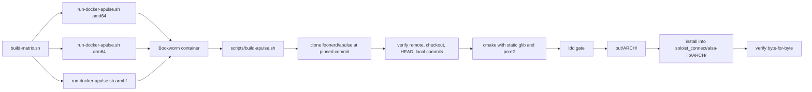
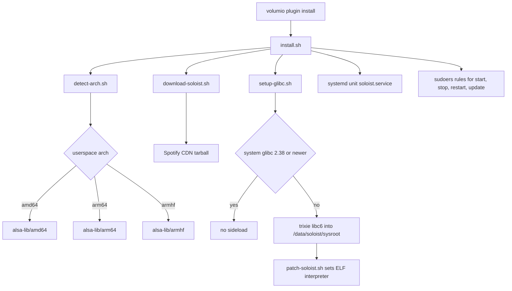
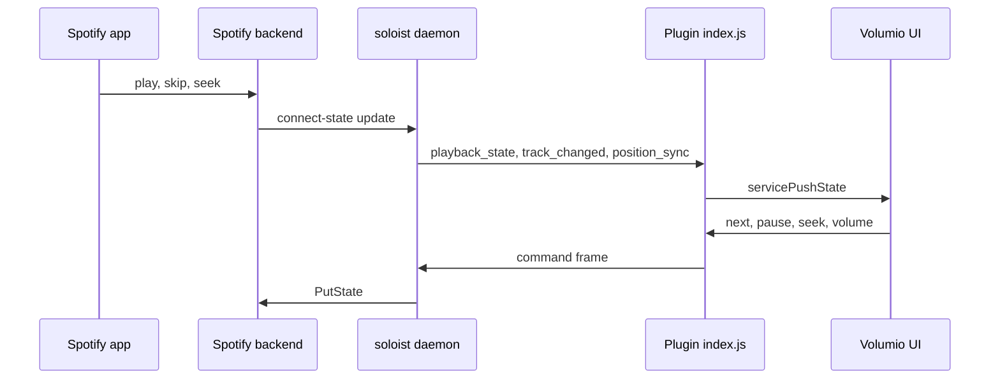

# alsa_soloist_connect

Build system and source for the **Spotify Soloist Connect** plugin for Volumio 4.

The plugin turns a Raspberry Pi or x86 Volumio 4 device into a Spotify Connect endpoint using [Spotify Soloist](https://developer.spotify.com/documentation/soloist), with audio leaving through `pcm.volumio`.
There is no PulseAudio daemon and no PipeWire on the device.

This repository holds two things: the plugin that ships to the Volumio plugin store, and the Docker build matrix that produces the native shim the plugin carries.

> **Alpha, version 0.3.0.**
> Under active development, not ready for user testing.
> Versioning and packaging will be revised before any release.

> **Unofficial project.**
> Not affiliated with, endorsed by or sponsored by Spotify AB.
> See [Trademarks](#trademarks) and [THIRD-PARTY-NOTICES.md](THIRD-PARTY-NOTICES.md).

User-facing documentation lives in [`soloist_connect/README.md`](soloist_connect/README.md), which ships inside the plugin package.
This document is for people building or modifying the plugin.

---

## Why a shim is needed

Soloist has no ALSA backend. It plays through PipeWire, or falls back to PulseAudio. Volumio 4 has neither.

The plugin therefore ships a private copy of [apulse](https://github.com/i-rinat/apulse), a PulseAudio client API implementation that talks to ALSA directly, and launches Soloist with `LD_LIBRARY_PATH` pointed at it.
apulse opens `pcm.volumio`, so Volumio's volume control, DSP and other AAMPP contributions all apply.

The copy is modified. It is built from [foonerd/apulse](https://github.com/foonerd/apulse), upstream at `5d654ce` with the Volumio changes as commits on `master`. See [Source](#the-apulse-fork).


Nothing else on the system is touched.
PulseAudio is never installed, and the system glibc is never modified.

---

## Repository layout

| Path | What |
|---|---|
| `soloist_connect/` | The Volumio plugin. This is what gets zipped and installed. |
| `soloist_connect/README.md` | User-facing documentation, ships with the package. |
| `soloist_connect/LICENSE` | MIT, ships with the package. |
| `soloist_connect/index.js` | Plugin controller: daemon lifecycle, WebSocket client, state mapping. |
| `soloist_connect/alsa-lib/{amd64,arm64,armhf}/` | apulse payload, built and installed by the Docker matrix. |
| `soloist_connect/alsa-lib/LICENSE.apulse` | apulse licence, travels with the binaries it covers. |
| `soloist_connect/*.sh` | Arch detection, CDN download, glibc sideload, ELF patch, launcher, install, uninstall. |
| `docker/` | One Bookworm Dockerfile per architecture, plus the runner. |
| `scripts/build-apulse.sh` | Runs inside the container. |
| `build-matrix.sh` | Builds all three architectures. |
| `THIRD-PARTY-NOTICES.md` | Full attribution for everything this project aggregates. |

`out/` is build output and is not committed.
The Soloist binary is never committed and never packaged.

---

## Building the apulse shim

The plugin package must contain `alsa-lib/<arch>/libpulse.so.0` for the target architecture.
Those libraries are built in Docker on a host with `qemu-user-static` for the ARM targets.



All three architectures:

```
cd alsa_soloist_connect
./build-matrix.sh
```

One architecture:

```
./docker/run-docker-apulse.sh amd64 --verbose
```

The build installs its output into `soloist_connect/alsa-lib/<arch>/` and compares every file byte-for-byte afterwards.
A mismatch or a missing file fails the build.
There is no manual copy step, deliberately: when there was one, a stale shim shipped while the build log looked correct, and three rounds of measurement were invalidated before anyone noticed.

Override the source revision when testing:

```
APULSE_REF=master ./docker/run-docker-apulse.sh amd64
```

### The apulse fork

The shim is built from [foonerd/apulse](https://github.com/foonerd/apulse), pinned to an exact commit. That is upstream [i-rinat/apulse](https://github.com/i-rinat/apulse) at `5d654ce` with the Volumio changes as commits on `master`:

```
git log --oneline 5d654ce..HEAD
```

Each commit carries its evidence in its message: the device captures, the disassembly, the arithmetic that justified it.

This was a patch series until the stack reached eight files. Every consolidation shifted the next patch's line numbers, and a hand-edited hunk header twice cost a build by silently dropping every hunk after it. Git maintains the arithmetic now, and a change is a commit rather than a diff to be transcribed.

Four of the commits are upstream defects rather than Volumio policy, and are worth submitting rather than carrying: a use-after-free on context teardown, a narrowing `g_memdup`, a `pa_stream_flush` that discarded nothing alongside an io callback that spun on a level-triggered `POLLOUT`, and a ring buffer sized in bytes rather than in time. `git format-patch 5d654ce..HEAD` produces them.

The device-ownership commits are Volumio policy and belong here rather than upstream. `pa_stream_cork` originally set a paused flag and kept the ALSA device open, writing silence into it, which is reasonable for a desktop and wrong on a system where one chain is shared: it held `pcm.volumio` for the entire Connect session.

Closing on cork was the obvious answer and it is wrong. A close creates a new device instance, so `hw_ptr` restarts at zero and the reopen races whoever took the chain in between; pause and play resumed silent, and switching source produced a retry loop against MPD. The PCM now survives cork, flush and uncork, uncork asks for data and starts the device again, and the close happens only when the plugin writes `APULSE_YIELD_PATH`. A write gap is not a release either: that was tried and reverted, because a live stream can be idle between writes.

The repo and commit are pinned in `docker/run-docker-apulse.sh` only. `scripts/build-apulse.sh` has no fallback and fails if they are unset. When the pin was duplicated in both and only one was updated, the runner's value won and a build produced stock upstream while the `ldd` gate, the payload verification and the manifest prune all passed. Every one of those compares the build to itself.

Four gates now catch a wrong tree, and each compares against something external:

- the existing clone's remote must match the requested repository, or it is re-cloned
- the checkout of the pinned commit must succeed
- `HEAD` must equal the requested commit afterwards
- there must be commits on top of `5d654ce`, since the shim is upstream plus changes by definition

The last one is what caught the stock build.

Override for testing:

```
APULSE_REF=<sha> ./docker/run-docker-apulse.sh amd64
```

### The ldd gate

The build fails if the resulting libraries link anything that is not on a stock Volumio 4 image.
The authority for that list is `volumio-os/recipes/base/VolumioBase.conf`, which has `libasound2` but not `libglib2.0`.
glib and pcre2 are therefore linked statically by rewriting the cmake `link.txt` files to use the `.a` paths.

Allowed runtime dependencies are the loader, the libc family, `libasound.so.2`, and the sibling `libpulse*` libraries.
Anything else rejects the build.

The pinned revision that produced each shipped payload is recorded in `soloist_connect/alsa-lib/<arch>/SOURCE_REVISION`.

Static linking of GLib carries an LGPL relink obligation.
It is satisfied by publishing this build recipe.
See [THIRD-PARTY-NOTICES.md](THIRD-PARTY-NOTICES.md) for the detail.

---

## Packaging and install

```
cd /home/volumio
mkdir -p soloist_connect && miniunzip soloist_connect.zip -d soloist_connect
cd soloist_connect
volumio plugin install
```

### What the installer does



Notable points:

- `libatomic1` and `patchelf` are installed if missing.
- Bookworm's glibc is 2.36 and Soloist needs 2.38 or newer. A private sysroot is sideloaded into `/data/soloist/sysroot` and the binary is ELF-patched against it. The system glibc is left alone. Launching through an explicit `ld-linux` instead of patching breaks Soloist's subprocesses.
- The unit sets `APULSE_PLAYBACK_DEVICE=plug:volumio`. The launcher additionally exports `APULSE_MAX_TLENGTH_MS` from the plugin's Output Buffer setting.
- Exit code 10 means the build expired. The unit uses `RestartPreventExitStatus=10` so it does not loop; the plugin re-downloads on the next start.
- Sudoers rules are named `volumio-user-soloist_connect` so they are included after `/etc/sudoers.d/volumio-user`, matching the convention in `volumio-plugins-sources-bookworm`.

---

## Architecture detection

`detect-arch.sh` picks both the Soloist binary and the apulse libraries from the userspace ABI (`dpkg`, `getconf LONG_BIT`, then `VOLUMIO_ARCH`), not from the kernel's `uname -m`.
The official Volumio 4 Pi image is armhf even when the kernel is 64-bit, and 64-bit Pi 5 images sometimes still report `VOLUMIO_ARCH=arm`.

| Userspace | Soloist CDN archive | apulse payload | Store architecture |
|---|---|---|---|
| `amd64` | `soloist_release_x86_64.tar.gz` | `alsa-lib/amd64` | `amd64` |
| `armhf` | `soloist_release_arm32.tar.gz` | `alsa-lib/armhf` | `armhf` |
| `arm64` | `soloist_release_arm64.tar.gz` | `alsa-lib/arm64` | none, manual install only |

armv6 (Pi 1, Pi Zero v1) is not supported by Soloist.

### Store architectures are not build architectures

The Volumio plugin store accepts only `amd64` and `armhf` in `volumio_info.architectures`.
Those are the two values `package.json` declares.

Do not confuse them with the volumio-os build targets (`arm`, `armv7`, `armv8`, `x64`), which are a different namespace and will be rejected by the store.

The arm64 apulse payload is kept in the tree because `detect-arch.sh` can select it at runtime on a 64-bit userspace image, but it has no store architecture to be published under.
Official Volumio 4 Pi images are armhf userspace even on a 64-bit kernel, so the armhf package covers them.

Plugins must be submitted with `volumio plugin submit` from a running Bookworm device, once per architecture, and the version number must change for every resubmission.

---

## Control and state flow

The plugin is a WebSocket client of the Soloist daemon on `127.0.0.1:9878`.
Commands go one way, events come back the other.



Behaviour worth knowing when reading `index.js`:

- **The PCM is the lock.** Device ownership is not tracked with plugin flags; it is read from `/proc/asound/card*/pcm*p/sub*/status`. See [Device ownership](#device-ownership).
- `is_active` is only trusted when the event actually carries it. Several Soloist events omit it, and treating a missing field as false used to end the session and cause a play/pause loop.
- Volumio's state machine calls `stop()` on volatile services shortly after volatile mode begins. That echo is swallowed for two seconds; every later stop is a real request and is honoured.
- **The seek timer does not publish.** It advances `seek` locally once a second, as the stock Spotify plugin does. A publish per second runs the state machine, `volumiodiscovery`, every interface plugin and MRS's multiroom sync; that plus `volumioswitch` failed `snd_pcm_avail(softvolume)` and XRUN'd the DAC on first play. `getState()` already returns the interpolated position, and real status and track changes still publish.
- `buffering` is mapped to the current status rather than to `pause`, so the state machine does not flap at every track start. `idle` is mapped the same way while playing: it is the gap between Spotify tracks, not a source stop, and publishing it as `stop` hit Volumio's end-of-block path, which starts the next queue item, while our own `stop()` paused Soloist. Nothing advanced.
- Volume is mirrored both ways with a short collapse window, so a slider drag does not queue one `set_volume` per tick ahead of a skip.
- Sample rate comes from ALSA `hw_params` on the open playback stream, since the Soloist WebSocket API does not report it. With FusionDSP enabled this reports CamillaDSP's output rate rather than the stream's; FusionDSP publishes the true stream parameters to `/tmp/fusiondsp_stream_params.log`, which this does not yet read.
- The bit depth field carries the Spotify quality tier instead of a bit depth. See [Reporting the quality tier](#reporting-the-quality-tier).

---

## Device ownership

A Volumio source holds the audio device only while it is playing, and publishes state only while it owns the session. This plugin took a long time to get there, because ownership was tracked with plugin-local booleans while the thing actually contended for was the ALSA device.

The model is now the same as bluetooth's `btAudioOutput`: **the PCM is the lock, and a yield does not return until we no longer hold it.** Bluetooth can SIGKILL `bluealsa-aplay`; Soloist cannot be killed, so the close is requested explicitly and the plugin waits for the owner to disappear from `/proc/asound`.

**Cork is not a close.** Pausing in the Spotify app keeps the device, which is what makes resume instant and gapless. Closing on cork was tried and reverted: a close creates a new device instance, and the reopen fought whoever had taken the chain in the meantime.

The close is therefore signalled, not inferred. The plugin writes `/data/soloist/alsa.yield`; apulse closes the PCM when it sees that file and unlinks it. `APULSE_YIELD_PATH` is exported by `launch-soloist.sh`. The file is cleared on daemon start and at the top of every takeover, so a stale one cannot release a session that is starting.

Four helpers read the lock:

| Function | What it answers |
|---|---|
| `alsaOwnerPids()` | every `owner_pid` across the playback substreams |
| `daemonPids()` | which of those are ours: the unit's `MainPID`, plus any owner whose `comm` is `soloist` or `launch-soloist.sh` |
| `alsaHeldByUs()` / `alsaHeldByOther()` | the two comparisons |
| `waitUntil(pred, ms)` | polls at 20 ms with a ceiling, resolving either way |

**Yield** happens in `unsetVolatile()` and in `stop()`, and nowhere else: request the close, pause, then wait until the PCM is no longer ours. Volumio then starts the next service against a free device. Without the wait, MPD reported `Failed to open ALSA device "volumio": Device or resource busy` in the same second the pause was sent, because `clearQueue` does not await the stop promise.

**Takeover**, in `takeOverPlayback()`, is serialised by `takeoverInFlight`:

1. if core already names us, or we already hold the session, clear the yield file and claim. A play from the phone while we hold the session is not a takeover, and `unSetVolatile` would run the volatile callback, which is ours, pausing Soloist on every play.
2. otherwise, synchronously: set `mpd.ignoreUpdate(true)`, clear the consume-update service, and drop our own volatile registration so `volumioStop` stops the other service rather than pausing us
3. `volumioStop()`, then wait until no other process holds the device
4. claim, and clear the yield file

**Takeover must not yield.** On first play the device is already open, and Peppyalsa negotiates a different period than we do (16384 against 22050). Releasing our own handle and reopening in that state failed `avail()`. Takeover displaces whoever else holds the device; it does not release ours.

`ignoreUpdate` is why step 2 exists at all. MPD announces its stop, `syncState` reads that as end-of-track and starts the next queue item, and MPD is back on `pcm.volumio` alongside Soloist. ytcr and squeezelite_mc mute it the same way. It is cleared on start, on stop, on yield and in `unsetVolatile`, so it can never be left latched.

The claim is unconditional, including when the wait expires. Refusing to claim was tried: the user pressed play and got a session that belonged to nobody. The shim recovers on its own, reopening the switcher handle if it has gone dead, so the right answer to a slow release is to proceed rather than to stop.

Two state rules that are not obvious and both came from real failures:

`active` is Spotify Connect device status and is **not** cleared on yield. Clearing it made the next `is_active=true` look like a fresh selection, and the session was stolen back from MPD.

`pendingYieldAt` covers the opposite race. A `play` arriving within 1.5 s of a yield is leftover from the session we just released, not a request, and is treated as a pause.

Takeover fires on the transition into play, not on activation. After the user switches away, Soloist stays the active Connect device, so `is_active` never transitions again; without the play trigger, pressing play in the app produced audio with no Volumio state at all.

The corresponding half is in the fork: the PCM survives cork, flush and uncork, uncork asks for data and starts the device again, and the close happens only when the yield file appears.

---

## Volume

Where the attenuation happens depends on Volumio's mixer, read from `alsa_controller`'s `mixer_type`.

With a mixer, SoftMaster or hardware, that mixer is the attenuator and the source must stay at full scale. The Spotify app's slider is mirrored into Volumio's fader with `volumiosetvolume`, so the signal entering the chain is pre-fader. This is what PeppyMeter needs: a meter reads the signal where it is inserted, above the fader, so a scaled source makes the needle follow the volume knob rather than the music.

With `mixer_type` `None` there is no ALSA gain anywhere, so the shim keeps scaling and the mixer is left alone.

Two rules that are not obvious:

**Mixer writes are gated on ownership.** A value arriving before we are `active` and volatile is parked in `pendingMixerVolume` and flushed at the end of `setVolatile()`. The first `playback_state` runs `takeOverPlayback`, whose `volumioStop` is asynchronous, so writing the mixer in the same tick meant an `amixer` against a softvolume MPD still owned.

**The echo guard is a timer, not a tick.** `volumeFromSoloist` is a 1.5 s window cleared by the returning event. A `setImmediate` expired long before the mixer round trip came back, so our own change was read as the user's and mirrored to Connect again.

Both directions use a two-step deadband, and the outbound mirror collapses bursts so a slider drag does not queue one `set_volume` per tick ahead of a skip: Soloist handles commands serially and that queue was seconds of lag.

### Output trim

A fixed offset on the stream, `-12` to `+12` dB, default 0. Distinct from volume: it changes the level entering the chain, not the knob.

It exists because with `APULSE_EXTERNAL_VOLUME` set the shim does no sample scaling at all, so this is the only place a per-source offset can be applied. It is what raises or lowers what per-source meters and the mixer see from Spotify without affecting MPD or anything else.

`output_trim_db` reaches the daemon as `OUTPUT_TRIM_DB`, and `launch-soloist.sh` exports `APULSE_OUTPUT_TRIM_DB` only when it is non-zero. The shim applies it before the ALSA write (fork `858521f`).

The launcher validates with an explicit case list rather than a `[0-9]*` glob. A leading minus does not match that glob, so `-6` would have been silently discarded and the setting would have appeared to work in one direction only.

---

## PeppyMeter integration

PeppyMeter meters per source rather than across the whole chain. Its contribution renders `pcm.spotify` either as a passthrough or as a `multi` that sends the audio to `postpeppyalsa` and a duplicate to a meter, and it decides which from its own setting.

It cannot rewrite this plugin's configuration the way it rewrites `spop`'s YAML, so it calls `setPeppyMetering(bool)` instead. That stores `peppy_metering`, rewrites the env file, and restarts the daemon only when nothing is playing.

`playbackDevice()` resolves the result: `plug:spotify` when metering is on **and** `pcm.spotify` is actually present in `/etc/asound.conf`, otherwise `plug:volumio`. The setting alone is not enough, because that PCM only exists once PeppyMeter has rendered its contribution; without the check a restart would try to open a device that is not there.

The other direction is covered on start. `syncPeppyMeteringFromPeppy()` asks PeppyMeter's `soloistMeteringWanted()` and adopts the answer, so the two plugins agree whichever is enabled second.

### The systemd pin had to go

`PLAYBACK_DEVICE` is written to the env file and read by `launch-soloist.sh`, which treats an existing `APULSE_PLAYBACK_DEVICE` as a deliberate override. Older installs pinned that in the unit:

```
Environment=APULSE_PLAYBACK_DEVICE=plug:volumio
```

which wins permanently, so the env file would never be read and metering would appear to do nothing at all. `unpin-playback-device.sh` strips that line and reloads systemd; `onStart` runs it whenever the line is present. `install.sh` no longer writes it, and both sudoers entries are in place.

`peppy_metering` is deliberately absent from `UIConfig.json`. PeppyMeter owns the toggle, and two switches for one behaviour drift apart.

### Running alongside the stock Spotify plugin

`warnIfSpopStarted()` reads `/data/configuration/plugins.json` and toasts a warning when `music_service.spop` is STARTED, on plugin start and when the settings page opens. Both plugins claim the same source and the same metered PCM; running them together is not supported.

---

## Reporting the quality tier

The now-playing line shows the Spotify quality tier, matching the names in the app's audio quality menu: Low, Normal, High, Very High, Lossless.

Nothing in Soloist reports it. The WebSocket schema is fully documented and `playback_state` carries only `status`, `item`, `context`, `position`, `volume`, `is_active`, `options` and `available_actions`; the entity envelope carries `identity`, `visual_identity`, `parent`, `creators` and `playback.duration_ms`. There is no codec, bitrate, sample rate or quality field anywhere, and others have asked Spotify for one on the developer forum. Its FFmpeg stream-info dump is debug-only: verified with `--verbose` confirmed on the running daemon and 60 s of playback captured, producing no output.

Bit depth is no guide either. Soloist decodes every quality into `FLOAT_LE`, and `/proc/asound` shows the endpoint after `pcm.softvolume` converts, so that field read `24 bit` for lossy and lossless alike. It carries the tier instead, which is what the user actually chose, and it lands where Volumio already shows quality beside the sample rate. The stock Spotify plugin does the same thing with its configured bitrate string.

The measurement is the cache. Soloist writes one content-addressed file per track and it is already complete when playback starts: sampled every two seconds over ten, the size did not move. Size against `duration_ms` is therefore the exact average bitrate.

**The file is identified by open descriptor, not by mtime.** Soloist holds the playing track's file open under `/proc/<pid>/fd`, and it follows every skip within a second. Audio payloads are under `cache/cache/`; the LevelDB metadata store is under `data/cache/` and must not match.

Choosing by mtime instead was wrong, and wrong quietly. The two newest files are usually the current track and its prefetch, but under skipping there are several partial downloads in flight, and the duration comes from the current `track_changed` event while the file came from the cache. The same 6289411 bytes was reported against 185 s and then 232 s, giving Very High and then High for one file.

A measurement is only taken when the same track URI and the same open file are seen twice in succession. During a handover two files are open and nothing is measured. Under rapid skipping the open file changes constantly, nothing is measured, and the previous label stands.

Measured on device: 333 kbps against Spotify's stated 320 for Very High, and 1654 and 1662 kbps across two different lossless tracks, which is where FLAC at 44.1 kHz sits.

One limitation: this measures what was downloaded, not what Spotify holds. A track only available at a lower tier than selected will show the lower tier. That is arguably more accurate than echoing the setting, but it will differ from the app's menu on some tracks.

---

## Buffering and the ALSA chain

`pcm.volumio` is not a direct path to the hardware. It resolves through `volumioswitch`, an ioplug that keeps its own buffer **and** separately sizes the buffer of its target PCM from `io->buffer_size`, reporting the sum as its delay:

```c
*delayp = local_delay + target_delay;
```

Both stages derive from `buffer_attr.tlength`, so a client's request lands twice, in series. Each stage is capped by the ioplug at `SND_PCM_IOPLUG_HW_BUFFER_BYTES`, 524288 bytes, which is 65536 frames or 1.486 s at 44100 S24_LE stereo. apulse's 2 s default therefore produced about 2.97 s of committed audio.

Measured on a Pi with a HiFiBerry DAC, skip command to first audible frame:

| Output device | Latency |
|---|---|
| `plug:volumio` | 3 s |
| `volumio` (empty passthrough) | 3 s |
| `volumioMultiRoomServer` (volumioswitch) | 3 s |
| `volumioLocalPlayback` | 1 s |
| `softvolume` | 1 to 2 s |
| `plughw:sndrpihifiberry` | 1 s |

The hardware buffer read 65536 frames in every case, so the extra time is the switch's own buffer, not the endpoint.

Moving the output device down the chain would recover the time and is the wrong fix: every faster path bypasses the contributions from FusionDSP, PeppyMeter, Stylish Player and mpd_oled, which is the whole reason for entering at `pcm.volumio`. The cap is applied in apulse instead, where it shrinks both stages together because the switch sizes its target from what the client asks for.

At 500 ms the hardware reports `buffer_size` 22050 frames with `period_size` 882, against 65536 and 512 at the default.

The switch's own `snd_pcm_delay` can still sit at 65536 frames (~1.48 s) after that shrink. Soloist reads that through Pulse as latency, and the fork caps the Pulse figure rather than the `/proc/asound` `delay` line.

`minreq`, and therefore the ALSA period, is `tlength/4`. That sets the useful floor: at 100 ms the period is 25 ms, which is about as low as a loaded Pi tolerates.

### Supply rate, and why lossless was the only quality that hunted

The buffer work above bounded the latency but did not stop lossless rushing and slowing. Six changes to the playback clock made no audible difference. An upstream trace of the Soloist to apulse conversation showed why: the clock was never the problem.

Soloist was supplying audio at **1.234x realtime**. It writes 32768 bytes at a time, which is 93 ms at float32 stereo, and the median gap between writes was 98 ms, but 43% of writes arrived faster: 26% at 40 to 80 ms, 13% at 10 to 40 ms, 4% under 10 ms. It filled the ring, got a zero from `pa_stream_writable_size`, stalled, then burst again. That alternation is what you hear.

Two causes, both in apulse, and both explain why only lossless was affected.

**The ring was sized in bytes.** `ringbuffer_new(72 * 1024)` is a duration only if the frame size is fixed: 418 ms of S16 stereo, but 209 ms of FLOAT32 stereo. Soloist decodes lossy to S16 and lossless to FLOAT32, so lossless got half the buffer while writing twice as much per call. The ring is now 500 ms at the client's own frame size.

**`writable_size` reported the whole ring rather than the room left against `tlength`.** A real PulseAudio server bounds it by the target, which is what holds a client at the level it was told to hold. Without that bound the client writes until the ring is full instead of until the target is met. It is now `tlength - fill`.

The bound has a consequence that has to be handled with it: a flush discards the ring, so both `write_index` and `read_index` must reset with it. Leaving `write_index` at its accumulated value made `fill` read as the whole session, `room` went negative, `writable_size` returned zero permanently, and track changes hung with no response at all. `pa_stream_disconnect` has the same hazard for a reconnect on the same stream.

One related upstream behaviour is now fixed rather than bounded. apulse implemented `pa_stream_flush` as a no-op:

```c
static void pa_stream_flush_impl(pa_operation *op) {
    // TODO: is it ok to do nothing?
```

so a skip discarded nothing and the already-committed audio played out. Confirmed on hardware by sampling `delay` across a skip: it never fell. The flush now drops the ring, drops and re-prepares the device, and resets the indices and the clock with it.

---

## Known limitations

- **90-day build expiry.** Soloist builds stop working 90 days after their build date. This is a Spotify design decision. The plugin re-downloads on start and offers a manual update button.
- **Skip and seek are not instant.** Bounded by the Output Buffer setting. The flush now discards, so what remains is the buffer itself rather than stale audio playing out.
- **Soloist has no latency control of its own.** Its CLI has no buffer or latency option, and the PulseAudio buffer parameters it uses are configured remotely by Spotify. The cap is applied in our apulse build instead.
- **FusionDSP changes the numbers.** CamillaDSP adds `chunksize`, `target_level` and `extra_samples` beyond our buffer, and its FIFO is `clear_on_drop "false"`. The 500 ms default has not been re-measured with FusionDSP enabled.
- **PeppyMeter metering.** When the screensaver's Spotify metering is on, the daemon plays through `plug:spotify`, PeppyMeter's metered entry at contribution priority 5, so its VU meters respond to Spotify. Contributions above that point are skipped: FusionDSP at 10 and Stylish Player at 7. PeppyMeter already forces its Spotify toggle off when DSP is on. See [PeppyMeter integration](#peppymeter-integration).
- **Switching source pauses Spotify rather than ending the session.** The device stays in the Spotify app's list, which is deliberate: giving up active-device status would make the user re-select the player just to switch back.
- **arm64 is unverified at runtime.** Built by the matrix and carries the same commits, but only armhf and amd64 have been exercised.
- armv6 devices are out of scope.

---

## Where to report problems

This repository does not own the upstream components it integrates.
Please route reports to the project that can act on them.

| Symptom | Where it belongs |
|---|---|
| Plugin behaviour, packaging, install, Volumio integration | this repository |
| Soloist client bugs and crashes | [spotify/soloist issues](https://github.com/spotify/soloist/issues) (issue creation is currently restricted) |
| Soloist questions, support, feature requests | the [Spotify Developer Community](https://developer.spotify.com/community) thread linked from the Soloist docs |
| Spotify account, playback rights, Connect behaviour | Spotify support |
| apulse behaviour, including the flush and buffering findings | [i-rinat/apulse issues](https://github.com/i-rinat/apulse/issues) |
| Volumio core, AAMPP, ALSA chain | Volumio's own trackers |

**Never post API keys, unredacted logs, crash reports or data directory contents in any public tracker.**
Spotify's documentation states this explicitly for Soloist, and it applies here too.

---

## Licence

MIT, Copyright (c) 2026 Just a nerd. See [LICENSE](LICENSE).

This repository aggregates third-party components and does not relicense, override or replace any of their terms.
Every redistributed component keeps its own licence, and those terms govern that component.

Summary:

| Component | Licence | Redistributed here |
|---|---|---|
| This project's code | MIT | yes |
| apulse | MIT | yes, as prebuilt libraries under `soloist_connect/alsa-lib/`, built from the fork |
| GLib | LGPL-2.1-or-later | statically linked into the apulse libraries |
| PCRE2 | BSD-3-Clause | statically linked into the apulse libraries |
| PulseAudio public headers | LGPL-2.1-or-later | no, build-time only |
| Spotify Soloist | proprietary, Spotify AB | **no**, downloaded from Spotify's CDN at install time |
| glibc sideload packages | LGPL-2.1-or-later and Debian terms | no, downloaded from the Debian archive at install time |

Full detail, including the LGPL relink statement and the Soloist redistribution position, is in [THIRD-PARTY-NOTICES.md](THIRD-PARTY-NOTICES.md).

---

## Trademarks

None of these marks are owned by this project.
They are used descriptively, to identify the software this plugin works with.
No affiliation, endorsement or sponsorship is claimed or implied.

| Mark | Owner |
|---|---|
| Spotify, Spotify Connect, Spotify Soloist | Spotify AB |
| Volumio | Volumio SRL |
| Raspberry Pi | Raspberry Pi Ltd |
| Debian | Software in the Public Interest, Inc. |
| Linux | Linus Torvalds |

---

## Credits

- [wheaten](https://github.com/wheaten/) started this work.
- [nerd](https://github.com/foonerd/) took it over and carried it to the Volumio 4 ALSA path.
